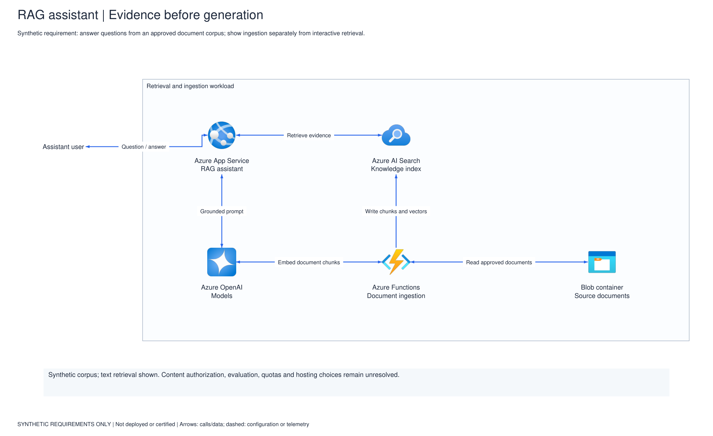
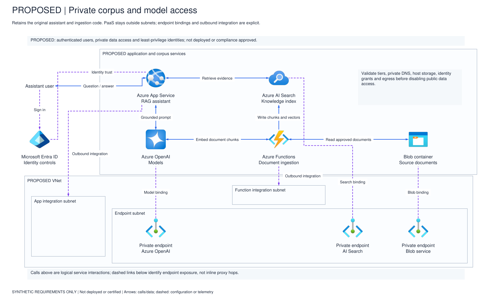
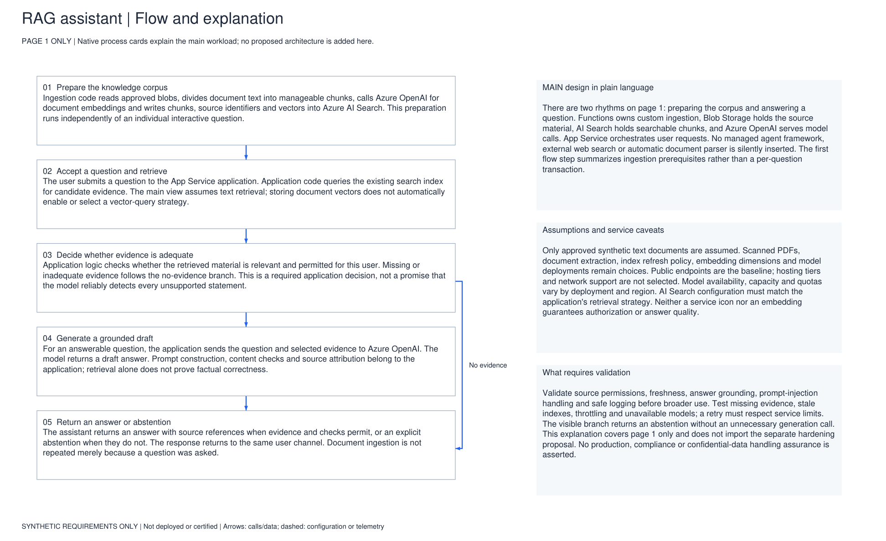

# Azure Visio Skill

Create editable Azure architecture **Visio + PDF** files with Scout or Copilot Cowork. Each v1.6 pack has three pages: **main architecture**, **conditional enterprise hardening/review**, and **detailed main-flow explanation**.

**[Download v1.6 ZIP](versions/v1.6/dist/azure-visio-1.6.0.zip)** | [v1.6 files](versions/v1.6/) | [v1.5 archive](versions/v1.5/)

Code, guides, tests, downloads, and screenshots are grouped inside each version folder.

## Install

**Scout:** Requires licensed desktop Visio on Windows. Extract the ZIP, keep its files together, and ask:

> Install azure-visio from [folder]. Register SKILL.md and all companion files, and complete the official icon setup.

**Cowork:** Open **Customize** (sidebar or **+**) > **Skills > Add > Upload skill** and upload the v1.6 ZIP, not GitHub's source archive. Cowork creates the files directly with Python, **without a Scout handoff**. Skill upload, Python/dependencies, and file downloads must be allowed by your organization's rollout and policy.

Start a **new chat/task** after installation.

## Try it

> Use azure-visio to draw [your requirements]. Deliver the three-page editable Visio and PDF. Use official icons and right-angle connectors. In Cowork, finish here without a Scout handoff.

[Setup and commands](versions/v1.6/README.txt) | [Editing guide](versions/v1.6/CRUD-Guide.txt)

## Three-page example

Synthetic RAG assistant generated with v1.6; illustrative, not a deployment or security certification.

### 1. Main architecture

### 2. Enterprise-hardening proposal

### 3. Main-flow explanation

Independent project, not an official Microsoft or GitHub product. Microsoft icons retain their [published terms](https://learn.microsoft.com/en-us/azure/architecture/icons/).
