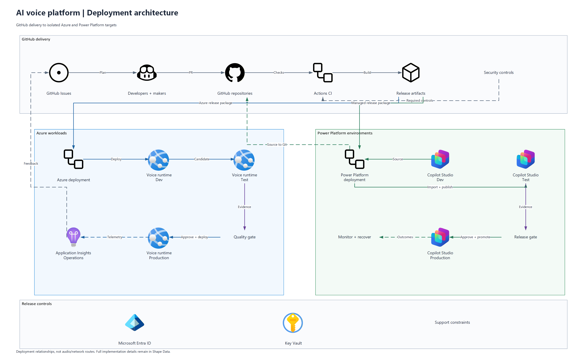

# Azure Visio Skill

Create editable Azure architecture diagrams and PDFs with **Microsoft Scout or Copilot Cowork**. Version 1.6 produces a three-page pack: the requested main architecture, a conditional enterprise-hardening proposal or applicability review, and a detailed flowchart/write-up of the main architecture.

**Scout uses desktop Visio. Cowork generates `.vsdx` and `.pdf` directly with the bundled Python renderer, without a Scout handoff.** Cowork must expose permitted Python execution, dependencies, and downloadable artifacts. The skill cannot grant missing host capabilities. This is an independent skill, not an official Microsoft or GitHub product.

## Install in Scout

1. Install and activate a licensed **desktop Visio** application on Windows. Visio for the web alone is insufficient.
2. Download [the skill ZIP](dist/azure-visio-1.6.0.zip) and extract it to a local folder outside OneDrive. Keep `SKILL.md` and all companion files together.
3. In Scout, ask:

   > Install azure-visio from [extracted folder path]. Register SKILL.md with your skill-management tools, copy every companion file into the skill's resource directory, and complete the official icon-library and reference-atlas setup under their published terms. Preserve existing settings and respect company policy.

4. Approve any required local file/shell access, then start a **new Scout chat**.
5. Try:

   > /azure-visio Create an Azure architecture with App Service and Azure SQL. Deliver a three-page Visio and PDF: main architecture, conditional enterprise hardening or review, and a detailed flowchart/write-up of the main architecture.

Visio opens automatically. Deletion, destructive replacement, and external sharing still require confirmation.

## Install in Copilot Cowork

1. Open Cowork with an account that has access.
2. Where custom-skill upload is available, open **Customize** from the left navigation or **+** menu, then **Skills > Add dropdown > Upload skill**.
3. Upload [the skill ZIP](dist/azure-visio-1.6.0.zip), not GitHub's **Code > Download ZIP** archive.
4. Start a new task: **"Use azure-visio to create this architecture. Run the portable renderer here and deliver actual three-page Visio and PDF files. Do not create a Scout handoff."**
5. Permit the required code execution and dependency/icon access under your organization's policies. Download the finished `.vsdx` and `.pdf` from that task.

If **Customize**, **Upload skill**, Python execution, or downloadable output is missing, availability depends on your Cowork interface and organization. Ask your administrator; do not bypass policy. Portable file creation does not provide desktop Visio control.

## Three-page behavior

Page 1 preserves the requested architecture. Page 2 proposes additional enterprise controls only when applicable and not already present or requested; otherwise it documents the hardening review without inventing a second design. Page 3 is a connected, text-rich flowchart and visible explanation of **page 1**, with component and relationship traceability.

Connections use only horizontal and vertical segments with right-angle bends. Each line attaches to its intended service, with clear return and control paths rather than diagonal shortcuts through unrelated icons or captions.

## Sample architecture images

- [Icon-first deployment architecture](examples/images/deployment-architecture.png)
- [Generic hub-and-spoke topology, legacy reference demo](examples/images/hub-spoke-reference.png)

These are illustrative outputs, not proof of deployment, security, or production readiness.

## More information

See [README.txt](README.txt) for manual setup and [CRUD-Guide.txt](CRUD-Guide.txt) for commands and limitations.

Product names, trademarks, and imagery remain their respective owners' property. Microsoft icons and reference downloads retain their [published usage terms](https://learn.microsoft.com/en-us/azure/architecture/icons/). Downloaded libraries, private configuration, customer source files, and native working drawings are not bundled in this repository.
